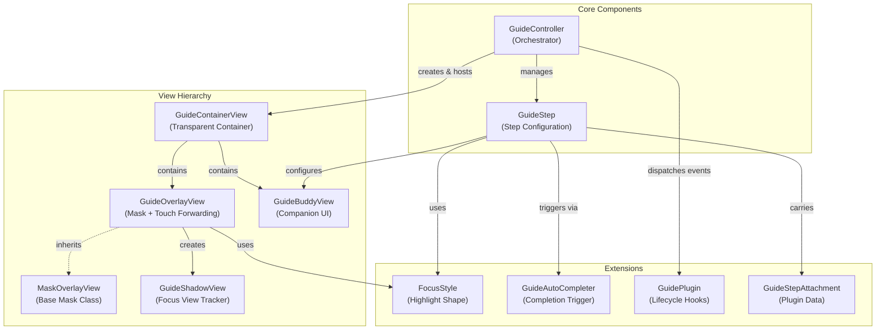

# PolarisGuideKit

[中文说明](README.zh-Hans.md)

A lightweight UIKit based guide/onboarding (“coach marks”) component for highlighting UI elements with a cut-out mask, optional companion views, and step-based orchestration.

## Features

- Highlight a single focus view with an animated mask transition (`GuideOverlayView`)
- Step-based guide orchestration (`GuideController` + `GuideStep`)
- Companion overlay UI via subclassing (`GuideBuddyView`)
- Customized auto-completion triggers (`GuideAutoCompleter`, `ControlEventCompleter`)
- Pluggable step extensions via plugins and attachments (e.g., audio playback)

## Requirements

- iOS 12+
- Swift 5.7+
- UIKit

## Installation (Swift Package Manager)

1. In Xcode: **File → Add Packages…**
2. Paste repo URL: `https://github.com/noodles1024/PolarisGuideKit`
3. Select **PolarisGuideKit**

If you use `Package.swift`, add a dependency on your repo and then:

```swift
import PolarisGuideKit
```

## Quick Start

```swift
import UIKit
import PolarisGuideKit

final class MyViewController: UIViewController {
    private var guide: GuideController?

    override func viewDidAppear(_ animated: Bool) {
        super.viewDidAppear(animated)

        let step1 = GuideStep()
        step1.focusView = myButton
        step1.buddyView = MyBuddyView()
        step1.forwardsTouchEventsToFocusView = true
        step1.completer = ControlEventCompleter(control: myButton, event: .touchUpInside)

        let controller = GuideController(hostView: view, steps: [step1])
        controller.onDismiss = { _, context in
            print("Guide dismissed. reason=\(context.reason)")
        }

        _ = controller.show()
        guide = controller
    }
}
```

## Custom Buddy View

Subclass `GuideBuddyView`, build your UI, and call `requestNext()` / `requestSkip()` when appropriate.

```swift
import UIKit
import PolarisGuideKit

final class MyBuddyView: GuideBuddyView {
    private let nextButton = UIButton(type: .system)

    override init(frame: CGRect) {
        super.init(frame: frame)
        nextButton.setTitle("Next", for: .normal)
        nextButton.addTarget(self, action: #selector(onNext), for: .touchUpInside)
        addSubview(nextButton)
        // layout your subviews...
    }

    required init?(coder: NSCoder) { fatalError("init(coder:) has not been implemented") }

    override func updateLayout(referenceLayoutGuide layoutGuide: UILayoutGuide, focusView: UIView) {
        super.updateLayout(referenceLayoutGuide: layoutGuide, focusView: focusView)
        // Position your subviews relative to layoutGuide.
    }

    @objc private func onNext() {
        requestNext()
    }
}
```

## Custom Focus Style

Create a custom `FocusStyle` to control highlight shape.

```swift
import UIKit
import PolarisGuideKit

struct MyRoundedStyle: FocusStyle {
    func highlightPath(for focusView: UIView, frameInOverlay rect: CGRect) -> UIBezierPath? {
        UIBezierPath(roundedRect: rect.insetBy(dx: -8, dy: -8), cornerRadius: 12)
    }

    func buddyLayoutGuide(for focusView: UIView, shadowView: GuideShadowView) -> UILayoutGuide {
        shadowView.frameLayoutGuide
    }
}
```

## Dynamic FocusView (UITableView/UICollectionView)

When highlighting cells in `UITableView` or `UICollectionView`, cells may be reused after `reloadData`, causing the highlight to shift or disappear. Use `focusViewProvider` to dynamically obtain the correct cell:

```swift
let step = GuideStep()

// Use focusViewProvider for dynamic cell lookup
step.focusViewProvider = { [weak self] in
    guard let self else { return nil }
    var focusCell = self.tableView.cellForRow(at: targetIndexPath)
    if focusCell == nil {
        self.tableView.layoutIfNeeded()
        focusCell = self.tableView.cellForRow(at: targetIndexPath)
    }
    return focusCell
}

step.buddyView = MyBuddyView()
```

The closure is called whenever the highlight needs to be updated, ensuring it always targets the correct cell even after `reloadData`.

> **Note**: For static views that don't change, you can still use `step.focusView = myView` directly.

## Plugins & Attachments

Use plugins for optional behaviors (e.g., audio). Attachments carry per-step data.

```swift
let step = GuideStep()
step.focusView = myButton

if let url = Bundle.main.url(forResource: "guide_step_1", withExtension: "mp3") {
    step.addAttachment(GuideAudioAttachment(url: url, volume: 0.8))
}

let controller = GuideController(hostView: view, steps: [step], plugins: [AudioGuidePlugin()])
```

Buddy views can adopt plugin-specific protocols when needed:

```swift
final class MyBuddyView: GuideBuddyView, GuideAudioEventReceiving {
    func guideAudioDidStart() { /* update UI */ }
    func guideAudioDidFinish() { /* update UI */ }
}
```

`stepDidShow` fires when the step is configured; `guideDidShow` fires after the overlay fade-in (if animated). Plugins that depend on fully visible UI should wait for `guideDidShow`.

## Architecture



## FAQ

### Touch forwarding doesn't work

- Ensure `step.forwardsTouchEventsToFocusView = true`
- Ensure the focus view is in the same window as the overlay

### Multi-window / multi-scene apps

Prefer passing an explicit `hostView` to `GuideController(hostView:steps:)` to avoid ambiguity.

## License

Licensed under the MIT License. See `LICENSE`.
