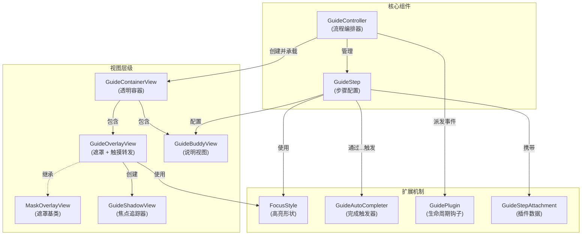

# PolarisGuideKit

[English](README.md)

一个轻量的基于 UIKit 的新手引导（coach marks）组件：通过遮罩挖孔高亮 UI 元素，并支持搭配说明视图（Buddy View）与按步骤编排的引导流程。

## 功能特性

- 单个 focusView 高亮（遮罩挖孔 + 可选过渡动画）：`GuideOverlayView`
- 以步骤编排的新手引导流程：`GuideController` + `GuideStep`
- 通过继承实现任意说明/箭头/按钮视图：`GuideBuddyView`
- 可自定义的自动“完成条件”：`GuideAutoCompleter`、`ControlEventCompleter`
- 可插拔的步骤扩展（插件 + 附件，例如音频播放）

## 环境要求

- iOS 12+
- Swift 5.7+
- UIKit

## 安装（Swift Package Manager）

1. Xcode：**File → Add Packages…**
2. 填入仓库地址：`https://github.com/noodles1024/PolarisGuideKit`
3. 选择 **PolarisGuideKit**

然后在代码里：

```swift
import PolarisGuideKit
```

## 快速开始

```swift
import UIKit
import PolarisGuideKit

final class MyViewController: UIViewController {
    private var guide: GuideController?

    override func viewDidAppear(_ animated: Bool) {
        super.viewDidAppear(animated)

        let step1 = GuideStep()
        step1.focusView = myButton
        step1.buddyView = MyBuddyView()
        step1.forwardsTouchEventsToFocusView = true
        step1.completer = ControlEventCompleter(control: myButton, event: .touchUpInside)

        let controller = GuideController(hostView: view, steps: [step1])
        controller.onDismiss = { _, context in
            print("引导结束。原因=\(context.reason)")
        }

        _ = controller.show()
        guide = controller
    }
}
```

## 自定义 Buddy View（说明/箭头/按钮等）

继承 `GuideBuddyView`，搭建 UI，在合适的时机调用 `requestNext()` / `requestSkip()`。

```swift
import UIKit
import PolarisGuideKit

final class MyBuddyView: GuideBuddyView {
    private let nextButton = UIButton(type: .system)

    override init(frame: CGRect) {
        super.init(frame: frame)
        nextButton.setTitle("下一步", for: .normal)
        nextButton.addTarget(self, action: #selector(onNext), for: .touchUpInside)
        addSubview(nextButton)
        // 自行布局...
    }

    required init?(coder: NSCoder) { fatalError("init(coder:) has not been implemented") }

    override func updateLayout(referenceLayoutGuide layoutGuide: UILayoutGuide, focusView: UIView) {
        super.updateLayout(referenceLayoutGuide: layoutGuide, focusView: focusView)
        // 根据 layoutGuide 相对定位你的子视图（避免遮挡高亮区域）
    }

    @objc private func onNext() {
        requestNext()
    }
}
```

## 自定义 FocusStyle（高亮形状）

实现 `FocusStyle`，控制挖孔形状（例如圆角等）。

```swift
import UIKit
import PolarisGuideKit

struct MyRoundedStyle: FocusStyle {
    func highlightPath(for focusView: UIView, frameInOverlay rect: CGRect) -> UIBezierPath? {
        UIBezierPath(roundedRect: rect.insetBy(dx: -8, dy: -8), cornerRadius: 12)
    }

    func buddyLayoutGuide(for focusView: UIView, shadowView: GuideShadowView) -> UILayoutGuide {
        shadowView.frameLayoutGuide
    }
}
```

## 动态 FocusView（UITableView/UICollectionView）

当高亮 `UITableView` 或 `UICollectionView` 中的 cell 时，`reloadData` 后 cell 可能会被复用，导致高亮区域错位或消失。使用 `focusViewProvider` 动态获取正确的 cell：

```swift
let step = GuideStep()

// 使用 focusViewProvider 动态查找 cell
step.focusViewProvider = { [weak self] in
    guard let self else { return nil }
    var focusCell = self.tableView.cellForRow(at: targetIndexPath)
    if focusCell == nil {
        self.tableView.layoutIfNeeded()
        focusCell = self.tableView.cellForRow(at: targetIndexPath)
    }
    return focusCell
}

step.buddyView = MyBuddyView()
```

每次需要更新高亮时都会调用此闭包，确保始终高亮正确的 cell，即使 `reloadData` 后也不受影响。

> **提示**：对于不会改变的静态视图，仍可直接使用 `step.focusView = myView`。

## 插件与附件

可选功能通过插件实现，附件用于承载每一步的插件数据。

```swift
let step = GuideStep()
step.focusView = myButton

if let url = Bundle.main.url(forResource: "guide_step_1", withExtension: "mp3") {
    step.addAttachment(GuideAudioAttachment(url: url, volume: 0.8))
}

let controller = GuideController(hostView: view, steps: [step], plugins: [AudioGuidePlugin()])
```

需要接收插件事件的 Buddy View 可以按需实现协议：

```swift
final class MyBuddyView: GuideBuddyView, GuideAudioEventReceiving {
    func guideAudioDidStart() { /* update UI */ }
    func guideAudioDidFinish() { /* update UI */ }
}
```

`stepDidShow` 在步骤配置完成后触发，`guideDidShow` 在（如果开启动画）遮罩淡入完成后触发；依赖“界面完全可见”的插件应等待 `guideDidShow`。

## 架构



## 常见问题

### 点击事件没有透传到 focusView

- 确保 `step.forwardsTouchEventsToFocusView = true`
- 确保 focusView 与 overlay 在同一个 window

### 多 window / 多 scene 场景

建议显式传入 `hostView`（`GuideController(hostView:steps:)`），避免"key window"歧义。

## License

本仓库采用 MIT License，详见 `LICENSE`。
